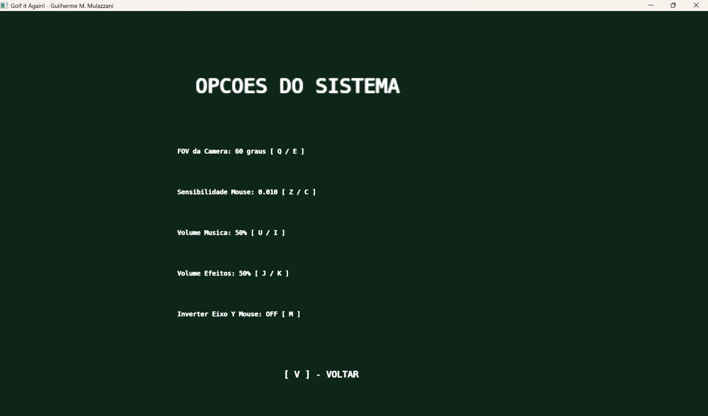
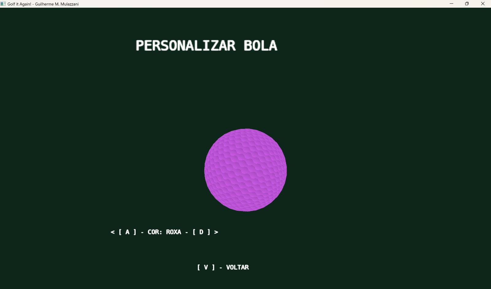
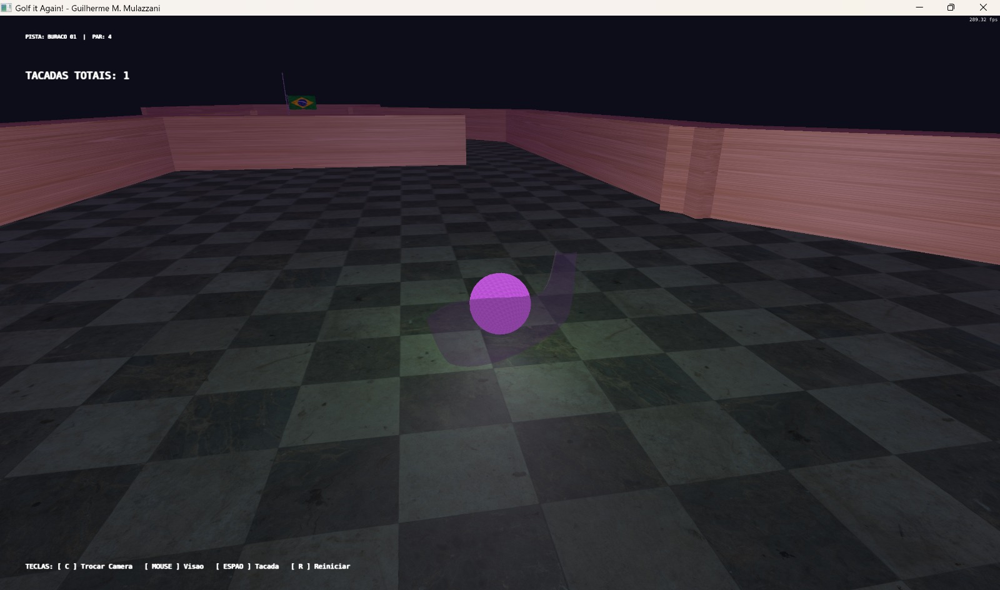
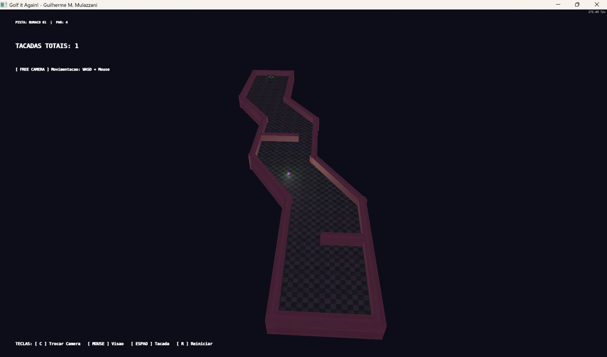

# Computação Gráfica e Visualização I (INF01047) - INF/UFRGS

## Aplicação do Golf It Again!
Neste repositório se encontra a aplicação de um desenvolvimento aplicado a criação de um jogo de Mini Golf 3D em C++, utilizando **OpenGL Moderno (Core Profile 3.3)**, baseado no framework da disciplina de Computação Gráfica I da UFRGS. Esta aplicação teve como objetivo aplicar os conhecimentos adquiridos durante as aulas. Neste trabalho, houve a implementação de features técnicas, como algumas delas sendo, **o uso do modelo de Iluminação de Phong (luz, difusa, especular e luz dinâmica na bola de golfe), mapeamento contínuo das texturas (World-Space UVs) e testes de intersecção matemática separada da renderização.** Pode-se citar também a implementação de mecânicas, sendo algumas delas **o controle de mira com o mouse, carregamento de força via teclado, sistema de colisão,rebatimento elástico e movimentação de obstáculos baseadas em Curvas de Bézier Cúbicas .**

## Contribuições
Trabalho foi feito de maneira individual, apenas com o apoio da IA. 

## Utilização de IA no Projeto
Houve o uso de IA neste projeto, foi utilizado o Gemini integrado com um "notebook" ensinado do Notebook LM. Ao utilizar apenas o Gemini, sem uma biblioteca treinada guiando, houve diversas dificuldades, principalmente na criação dos mapas (deixando brechas e vazamento da camera para dentro das paredes) e na utilização do framework utilizado. Ao adotar o LM como o "guia", o Gemini começou a dar respostas certeiras, auxiliando e facilitando muito o trabalho de criar este projeto. A IA foi utilizada neste projeto para fazer grandes atualizações ou mudanças no código, principalmente para mexer nos shaders, adicionar a curva de Bézier, a fazer depurações de erros de compilação no CMAKE e por fim para separar as colisões do resto do main.cpp.

## Imagens da Gameplay

## Manual de Utilização
Ao abrir, vai ter uma tela de menu, sendo 1 - Jogar (Ao apertar o número "1" irá abrir as 3 fases iniciais - o "1" do teclado numérico não reconhece), 2 - Opções (Ao apertar o número "2" aparece uma lista com configurações para personalizar - ao lado de cada opção tem as teclas para diminuir/aumentar/ligar) e 3 - Personalização da Bola (Ao apertar o número "3" irá abrir uma tela de personalização, com cores pré-selecionadas alternando em uma bola girando - Teclas também mostra para fazer a troca de cores). 
Dentro das Pistas - Para movimentar a câmera utilize o **Mouse/Mousepad** (ele que controla os ângulos da câmera LookAt). Para jogar a bolinha, ao apertar/segurar o **Espaço**, ele enche a barra de força da tacada e ao soltar bate e envia a bolinha. Ao apertar a **Tecla "C"**, ele alterna entre a câmera principal (centrada na bolinha) com o modo Free Camera, para se movimentar neste modo Free Camera, utilizar as teclas **"W,A,S,D"**. A tecla **"R"**, faz com que a bolinha reinicie, ou seja, volta para o ponto origem dela (no começo da pista). A tecla **"Enter"** avança para a próxima fase.

## Passo a passo para Compilar e Executar a Aplicação
Para compilar esta aplicação, deve-se primeiramente instalar o CMake e um compilador C++ (Como o MSVC do Visual Studio ou MinGW - utilizado neste projeto), logo após isto, crie uma pasta build na raiz do projeto, execute o CMake para gerar os arquivos de build (Pelo windows é `cmake ..`). Então compile o projeto com `cmake --build .` ou abra o .sln no Visual Studio e compile. Então execute o arquivo .exe gerado dentro da pasta bin/Debug ou bin/Release.
