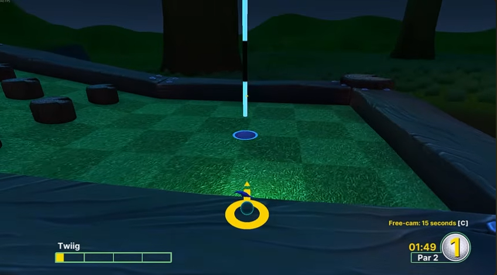
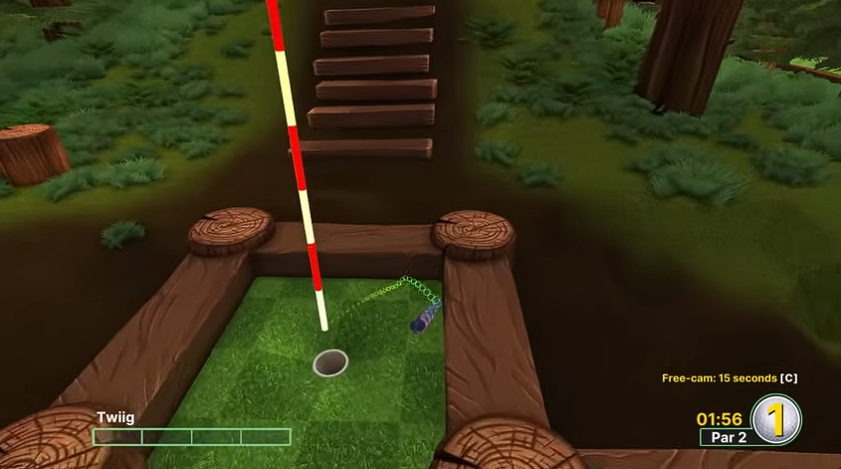
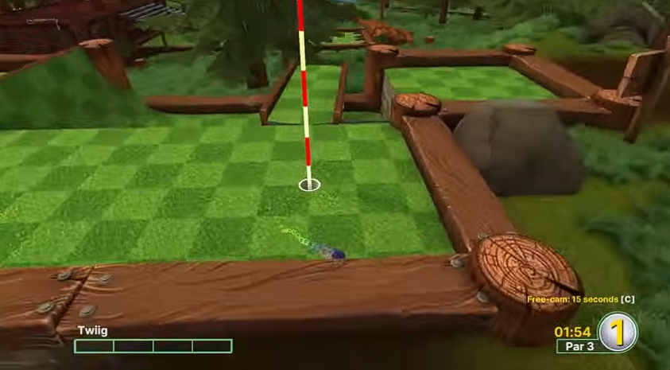

# Especificação da Implementação

> [!CAUTION]
> - Você <ins>**não pode utilizar ferramentas de IA para escrever esta
>   especificação**</ins>

## Integrantes da dupla

- **Aluno 1 - Nome**: <mark>`Guilherme Martins Mulazzani`</mark>
- **Aluno 1 - Cartão UFRGS**: <mark>`00597915`</mark>

## Detalhes do que será implementado

- **Título do trabalho**: <mark>`Golf it Again!`</mark>
- **Parágrafo curto descrevendo o que será implementado**: <mark>`<preencher>`</mark>

> Comentário Professor: Faltou preencher o parágrafo.

## Especificação visual

### Vídeo - Link

> [!IMPORTANT]
> - Coloque aqui um link para um vídeo que mostre a aplicação gráfica
>   de referência que você vai implementar. **Sua implementação deverá
>   ser o mais parecido possível com o que é mostrado no vídeo (mais
>   detalhes abaixo).**
> - **Você não pode escolher como referência: (1) algum trabalho realizado
>   por outros alunos desta disciplina, em semestres anteriores. (2) Minecraft.**
> - Por exemplo, você pode colocar um vídeo de um jogo que você gosta,
>   e seu trabalho final será uma re-implementação do jogo.
> - O vídeo pode ser um link para YouTube, Google Drive, ou arquivo mp4 dentro
>   do próprio repositório. Mas, garanta que qualquer um tenha
>   permissão de acesso ao vídeo através deste link.

<mark>`youtu.be/JBSSErUaLdo?si=x77eKVEaFgUZ70qu`</mark>

### Vídeo - Timestamp

> [!IMPORTANT]
> - Coloque aqui um **intervalo de ~30 segundos** do vídeo acima, que
>   será a base de comparação para avaliar se o seu trabalho final
>   conseguiu ou não reproduzir a referência.

- **Timestamp inicial**: <mark>`2:16 min`</mark>
- **Timestamp final**: <mark>`2:46 min`</mark>

### Imagens

> [!IMPORTANT]
> - Coloque aqui **três imagens** capturadas do vídeo acima, que você
>   irá usar como ilustração para as explicações que vêm abaixo.

<mark>

</mark>

## Especificação textual

Para cada um dos requisitos abaixo (detalhados no [Enunciado do Trabalho final - Moodle](https://moodle.ufrgs.br/mod/assign/view.php?id=6018620)), escreva um parágrafo **curto** explicando como este requisito será atendido, apontando itens específicos do vídeo/imagens que você incluiu acima que atendem estes requisitos.

### Malhas poligonais complexas
<mark>`A pista será construída utilizando geometria modular, mas a aplicação vai ter malhas complexas para os elementos que serão interativos. A bola será uma esfera com alta contagem de polígonos.O cenário contará com obstáculos decorativos (.obj) de geometria detalhada.`</mark>

### Transformações geométricas controladas pelo usuário
<mark>`Com o mouse, o jogador vai conseguir controlar o ângulo da mira, utilizando de rotações na camêra e vetor de direção. A força da tacada, também definida pelo usuário, vai gerar uma matriz de translação que vai movimentar a bola no eixo definido no cenário.`</mark>

### Diferentes tipos de câmeras
<mark>`Haverá duas câmeras, uma será Look-at orbital, que estará fixada na bola, a mesma será utilizada pelo jogador para mirar e calcular a tacada. Haverá também a câmera livre, controlada no teclado, deixando que o usuário navegue pelo mapa.`</mark>

### Instâncias de objetos
<mark>`Estruturas que serão repetitivas, como as paredes da pista e itens, serão desenhados utilizando instanciação. O modelo geométrico utilizado como base vai ser carregado apenas uma vez e desenhado múltiplas vezes em um loop de renderização, aplicando matrizes de translação, escala e rotação. (Modelagem)`</mark>

### Testes de intersecção
<mark>`A parte mecânica ficará dependente do arquivo collisions. Serão implementados testes de intersecção Esfera-Caixa, para que se possa calcular a batida da bola nas paredes e obstáculos. Também haverá um teste Esfera-Cilindro que vai servir para detectar quando o centro da bola atingir o buraco.`</mark>

### Modelos de Iluminação em todos os objetos
<mark>`A iluminação do ambiente vai ser mais baixa, com contrastes de fontes de luz pontuais espalhadas na pista, o que vai gerar reflexos na bola e obstáculos. A iluminação será calculado utilizando modelo de Blinn-Phong.`</mark>

> Comentário Professor: o efeito da fonte de luz que se movimenta junto com a bola também é importante implementar.

### Mapeamento de texturas em todos os objetos
<mark>`Todos vértices terão mapeamento UV. No piso, vai ter uma textura que vai simular material sintético, as paredes terão textura de metal/madeira, enquanto a bola vai ter uma textura vibrante, para ter o contraste visual com o cenário.`</mark>

### Movimentação com curva Bézier cúbica
<mark>`Na pista de golf, vai ter um objeto móvel (como um drone), o movimento de observação será calculado com a interpolação de sua posição ao longo da curva de Bézier cúbica.`</mark>

### Animações baseadas no tempo ($\Delta t$)
<mark>`A simulação não vai estar ligada ao framerate. A diminuição da velocidade da bola e a taxa de deslocamento espacial, a atualização do parâmetro de tempo para o movimento do obstáculo na curva de Bézier, serão multiplicados pelo tempo decorrido obtido pela GLFW.`</mark>

## Limitações esperadas

> [!IMPORTANT]
> - Coloque aqui uma lista de detalhes visuais ou de interação que
>   aparecem no vídeo e/ou imagens acima, mas que você **não pretende
>   implementar** ou que você **irá implementar parcialmente**.
> - Para cada item, **explique por que** não será implementado ou por
>   que será implementado parcialmente.

<mark>`Não pretendo implementar pistas com geometria curva e loops, pois o cálculo de colisão contínua da esfera sobre malhas curvas arbitrárias vai adicionar uma complexidade matemática adicional e excessiva.`</mark>
